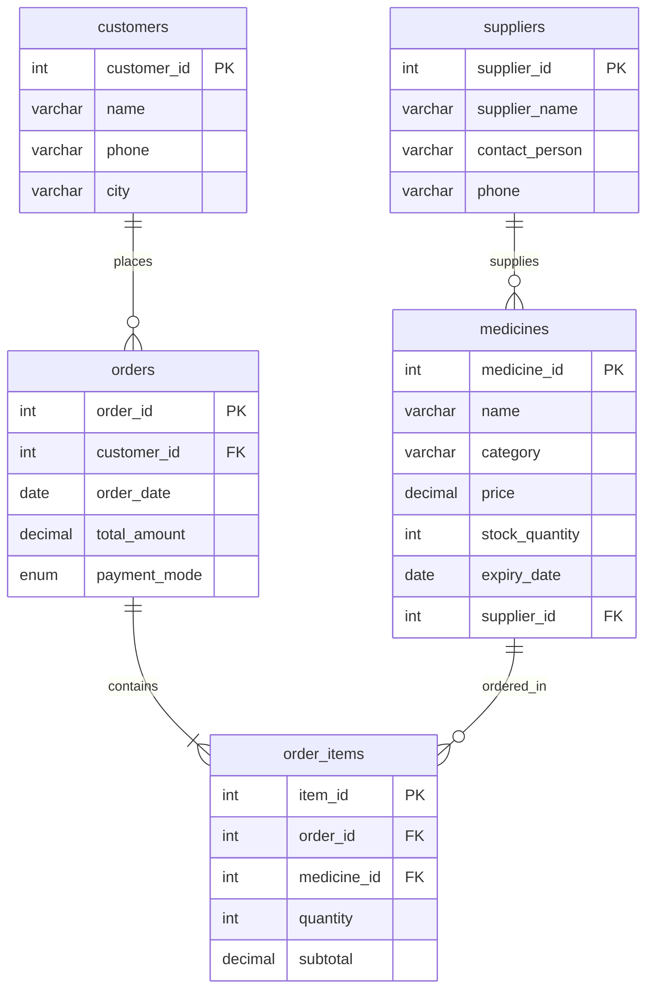

# MySQL Practice Lab – Jeevan Raksha Pharmacy

Jeevan Raksha Pharmacy is a localized pharmaceutical store database case study designed to model, manage, and query a typical retail pharmacy network. This project showcases standard relational database design, schema implementation, referential constraints, data seeding, and complex query solving in MySQL.

---

## 📋 Overview

The **Jeevan Raksha Pharmacy** system simulates a retail pharmacy business logic operation in India. It manages the relations between suppliers who distribute stock, the medicine inventory, customers making purchases, and transaction bills containing itemized purchases. The schema is normalized up to the **Third Normal Form (3NF)** to ensure zero redundancy and maximum transactional reliability.

---

## 🚀 Features

The system supports five core feature modules representing the primary business domains:

*   **Customers**: Tracks customer identity, contact information, and demographics.
*   **Suppliers**: Manages distributor contact info to streamline restocking pipelines.
*   **Medicines**: Tracks active inventory levels, medicine categories (e.g., Tablets, Syrups, Injections), unit prices, and expiration dates.
*   **Orders**: Records high-level transactions, dates, total billing amounts, and payment modes (UPI, Cash, Card).
*   **Order Items**: Breaks down transactions to show which medicines and quantities are linked to each bill, including item subtotals.

---

## 🗄️ Database Design

The schema consists of 5 normalized tables with clear referential constraints:

### 1. `customers` Table
Holds the profiles of customers who purchase medications.
*   `customer_id` (INT, PK, AUTO_INCREMENT): Unique identifier.
*   `name` (VARCHAR(100)): Full name.
*   `phone` (VARCHAR(15)): Phone number.
*   `city` (VARCHAR(50)): Residential city.

### 2. `suppliers` Table
Stores contact details for medicine distributors.
*   `supplier_id` (INT, PK, AUTO_INCREMENT): Unique identifier.
*   `supplier_name` (VARCHAR(100)): Distributor name.
*   `contact_person` (VARCHAR(100)): Representative name.
*   `phone` (VARCHAR(15)): Contact number.

### 3. `medicines` Table
Maintains details of the active drug inventory.
*   `medicine_id` (INT, PK, AUTO_INCREMENT): Unique identifier.
*   `name` (VARCHAR(100)): Brand/Generic name.
*   `category` (VARCHAR(50)): Drug category (Tablet, Syrup, etc.).
*   `price` (DECIMAL(10,2)): Unit cost.
*   `stock_quantity` (INT): Current inventory balance.
*   `expiry_date` (DATE): Product expiration date.
*   `supplier_id` (INT, FK): Links to the supplier.

### 4. `orders` Table
Records customer transactions/receipt summaries.
*   `order_id` (INT, PK, AUTO_INCREMENT): Unique identifier.
*   `customer_id` (INT, FK): Links to the purchasing customer.
*   `order_date` (DATE): Date of purchase.
*   `total_amount` (DECIMAL(10,2)): Sum of the transaction.
*   `payment_mode` (ENUM('UPI', 'Cash', 'Card')): Method used for payment.

### 5. `order_items` Table
A junction table establishing the many-to-many relationship between `orders` and `medicines`.
*   `item_id` (INT, PK, AUTO_INCREMENT): Unique identifier.
*   `order_id` (INT, FK): Links to the parent order.
*   `medicine_id` (INT, FK): Links to the purchased medicine.
*   `quantity` (INT): Quantity purchased.
*   `subtotal` (DECIMAL(10,2)): Cost of items (`quantity` × `price`).

---

## 📊 Entity Relationship Diagram

GitHub natively renders Mermaid.js code blocks directly into SVG graphics. Below is the Entity-Relationship Diagram for Jeevan Raksha Pharmacy:



---

## 🛠️ Technologies

*   **RDBMS Engine**: MySQL 8.0+
*   **Language**: SQL (Structured Query Language)
*   **Documentation**: Markdown & Mermaid.js

---

## ⚙️ Setup & Installation

### Option A: Unified Setup (Recommended)
You can setup the schema and load the sample data using the single `setup.sql` script:

1.  Open your MySQL Command Line or MySQL Workbench.
2.  Run the following command in terminal:
    ```bash
    mysql -u your_username -p < database/setup.sql
    ```

### Option B: Step-by-Step Installation
Alternatively, execute the modular SQL scripts sequentially:
1.  **Create Schema**: Run [database/schema.sql](file:///c:/mySQL/Jeevan-Raksha-Pharmacy/database/schema.sql) to build the database structure.
2.  **Seed Database**: Run [database/sample_data.sql](file:///c:/mySQL/Jeevan-Raksha-Pharmacy/database/sample_data.sql) to insert sample records.
3.  **Run Queries**: Execute scripts inside [queries/](file:///c:/mySQL/Jeevan-Raksha-Pharmacy/queries/) to analyze the data.

---

## 📝 Practice Tasks

The project contains solutions for five standard SQL query analysis challenges:

| Task | Target SQL File | Description | Core Concept Used |
| :--- | :--- | :--- | :--- |
| **Task 1** | `task1_customer_orders.sql` | Lists customer name, order date, and total amount for every transaction. | `INNER JOIN` |
| **Task 2** | `task2_payment_summary.sql` | Calculates total revenue generated through each payment channel. | `SUM()`, `GROUP BY` |
| **Task 3** | `task3_best_selling_medicine.sql` | Finds the single best-selling medicine by total volume sold. | `SUM()`, `ORDER BY`, `LIMIT` |
| **Task 4** | `task4_high_value_customers.sql` | Identifies loyalty customers who spent more than 1000 rupees. | `SUM()`, `GROUP BY`, `HAVING` |
| **Task 5** | `task5_low_stock_medicines.sql` | Emits inventory alert for medicines under 50 units with supplier details. | `WHERE`, `INNER JOIN` |

---

## 🧠 Learning Objectives

Through this project, the following core database development concepts were applied:

*   **Primary & Foreign Keys**: Enforcing integrity rules to prevent orphan records.
*   **Multi-Table Joins**: Using `INNER JOIN` to reconstruct relational views.
*   **Aggregation & Grouping**: Leveraging `SUM()` and `GROUP BY` to roll up transactional details.
*   **Conditional Filtering**: Applying `HAVING` to filter aggregated totals.
*   **Normalization Rules**: Designing schema to satisfy 1NF (atomic values), 2NF (removal of partial dependencies), and 3NF (removal of transitive dependencies).

---

## 📁 Folder Structure

```text
Jeevan-Raksha-Pharmacy/
├── README.md                  # Project overview and recruiter documentation
├── LICENSE                    # MIT License for open-source distribution
├── .gitignore                 # Exclusion configuration for build/IDE temp files
├── database/
│   ├── schema.sql             # SQL script for table creations
│   ├── sample_data.sql        # SQL script for inserting test data
│   └── setup.sql              # Combined database creation and seed script
├── queries/
│   ├── task1_customer_orders.sql
│   ├── task2_payment_summary.sql
│   ├── task3_best_selling_medicine.sql
│   ├── task4_high_value_customers.sql
│   └── task5_low_stock_medicines.sql
├── erd/
│   ├── pharmacy_erd.mmd       # Mermaid diagram syntax source file
│   └── README.md              # Help doc for Mermaid rendering & exports
└── docs/
    ├── project_overview.md    # Domain model details
    └── assumptions.md         # Constraints and data integrity notes
```

---

## 🔮 Future Improvements

Proposed feature enhancements for production-readiness:
*   **Automated Subtotal Triggers**: Implement an `BEFORE INSERT ON order_items` trigger to compute subtotals automatically based on the current unit price.
*   **Expiring Products View**: Create a virtual database `VIEW` highlighting medicines expiring within the next 90 days.
*   **Restocking Alerts**: Write a `STORED PROCEDURE` to automatically generate restock purchase orders when medicine quantities drop below threshold limits.

---

## ✍️ Author

*   **Your Name** - [GitHub Profile](https://github.com/placeholder) | [LinkedIn](https://linkedin.com/in/placeholder)
