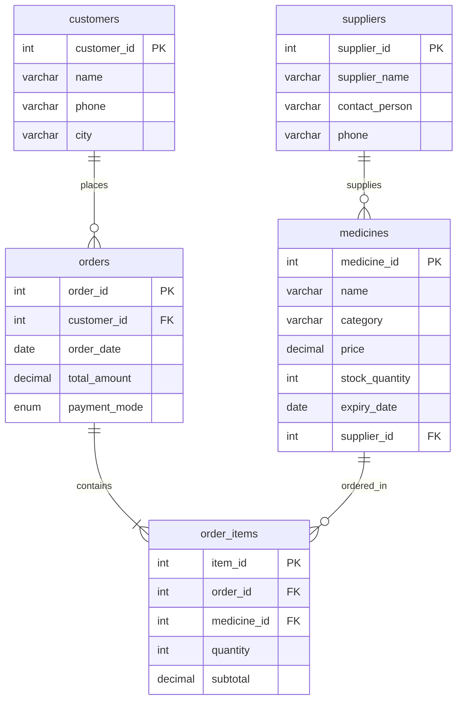

# Jeevan Raksha Pharmacy - Entity-Relationship Diagram

This directory contains the Entity-Relationship Diagram (ERD) for the **Jeevan Raksha Pharmacy** database schema.

---

## 1. ERD Preview

Below is the diagram rendered dynamically using Mermaid:



---

## 2. What is Mermaid.js?

[Mermaid.js](https://mermaid.js.org/) is a JavaScript-based diagramming and charting tool that uses Markdown-inspired text definitions and a renderer to create and modify complex diagrams dynamically. Instead of using GUI tools (like Visio or draw.io) to draw shapes and lines, you write plain-text code representing the elements and relationships, and Mermaid handles the rendering automatically.

---

## 3. GitHub Native Rendering

GitHub has built-in support for rendering Mermaid diagrams. Any fenced code block in a Markdown file (`.md`) marked with the language `mermaid` will be automatically compiled and displayed as an interactive SVG diagram on the web interface.

Example of how it looks in Markdown:
```text
​​​```mermaid
erDiagram
    customers ||--o{ orders : "places"
    ...
​​​```
```

---

## 4. How to Edit the Diagram

You can update the diagram by editing the plain-text definitions in:
* The source file: [pharmacy_erd.mmd](file:///c:/mySQL/Jeevan-Raksha-Pharmacy/erd/pharmacy_erd.mmd)
* The embedded block inside this README: [README.md](file:///c:/mySQL/Jeevan-Raksha-Pharmacy/erd/README.md)

### Tools for Editing
1. **Mermaid Live Editor**:
   - Go to [mermaid.live](https://mermaid.live/)
   - Copy-paste the code from [pharmacy_erd.mmd](file:///c:/mySQL/Jeevan-Raksha-Pharmacy/erd/pharmacy_erd.mmd) into the code pane.
   - You will see a real-time live preview of the changes.
2. **VS Code Extensions**:
   - Install **Markdown Preview Mermaid Support** or **Mermaid Previewer** to view live diagrams inside VS Code.

---

## 5. How to Export to PNG or PDF

If you need static image files (PNG) or document files (PDF) of the diagram:

### Method 1: Using the Mermaid Live Editor (Recommended)
1. Copy the code from [pharmacy_erd.mmd](file:///c:/mySQL/Jeevan-Raksha-Pharmacy/erd/pharmacy_erd.mmd) and paste it into [mermaid.live](https://mermaid.live/).
2. In the bottom-left panel, click on the **Actions** tab.
3. Click:
   - **PNG**: Download the diagram as a high-resolution PNG image.
   - **PDF**: Download the diagram as a document.
   - **SVG**: Download the vector format for scaling without quality loss.

### Method 2: Command Line Interface (CLI)
You can use `@mermaid-js/mermaid-cli` to compile the diagram locally:
1. Install the CLI using Node.js:
   ```bash
   npm install -g @mermaid-js/mermaid-cli
   ```
2. Compile to PNG:
   ```bash
   mmdc -i pharmacy_erd.mmd -o pharmacy_erd.png
   ```
3. Compile to PDF:
   ```bash
   mmdc -i pharmacy_erd.mmd -o pharmacy_erd.pdf
   ```
