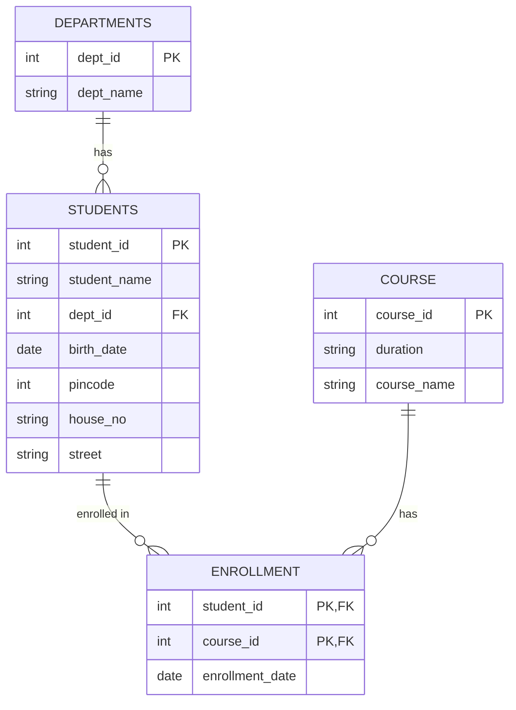

# Task 4

## Entity-Relationship (ER) Diagram

Below is the Entity-Relationship diagram for the database schema, including entities, attributes, keys, and their relationships.



### Explanation of Components

1. **Entities & Attributes**:
   - **DEPARTMENTS**: Represents academic departments.
     - `dept_id` (Primary Key): Unique identifier for each department.
     - `dept_name`: Name of the department.
   - **STUDENTS**: Represents the enrolled students.
     - `student_id` (Primary Key): Unique identifier for each student.
     - `student_name`: Name of the student.
     - `dept_id` (Foreign Key): Department the student belongs to.
     - `birth_date`: Birth date of the student.
     - `pincode`, `house_no`, `street`: Address details of the student.
   - **COURSE**: Represents the available courses.
     - `course_id` (Primary Key): Unique identifier for each course.
     - `duration`: Length of the course.
     - `course_name`: Name of the course.
   - **ENROLLMENT**: Represents the association (many-to-many relationship) between students and courses.
     - `student_id` (Composite Primary Key, Foreign Key)
     - `course_id` (Composite Primary Key, Foreign Key)
     - `enrollment_date`: Date the student enrolled in the course.

2. **Relationships**:
   - **DEPARTMENTS to STUDENTS** (`1:N`): A department can have multiple students, but each student belongs to exactly one department.
   - **STUDENTS to ENROLLMENT** (`1:N`): A student can have multiple course enrollments.
   - **COURSE to ENROLLMENT** (`1:N`): A course can have multiple student enrollments.

---

## Database Schema & Table Content

### 1. Departments Table

```sql
SELECT * FROM Departments;
+---------+------------------------+
| dept_id | dept_name              |
+---------+------------------------+
|     101 | Computer Science       |
|     102 | Information Technology |
|     103 | Mechanical             |
+---------+------------------------+
```

### 2. Students Table

```sql
SELECT * FROM Students;
+------------+--------------+---------+------------+---------+----------+--------------+
| student_id | student_name | dept_id | birth_date | pincode | house_no | street       |
+------------+--------------+---------+------------+---------+----------+--------------+
|          1 | Rahul        |     101 | 2003-05-10 |  500001 | 12A      | MG Road      |
|          2 | Priya        |     102 | 2004-08-15 |  500002 | 45B      | Nehru Street |
|          3 | Arjun        |     101 | 2003-12-20 |  500003 | 78C      | Gandhi Nagar |
|          4 | Sneha        |     103 | 2004-03-25 |  500004 | 21D      | Station Road |
+------------+--------------+---------+------------+---------+----------+--------------+
```

### 3. Course Table

```sql
SELECT * FROM Course;
+-----------+----------+-------------+
| course_id | duration | course_name |
+-----------+----------+-------------+
|       201 | 6 Months | SQL         |
|       202 | 4 Months | Java        |
|       203 | 5 Months | Python      |
|       204 | 3 Months | DBMS        |
+-----------+----------+-------------+
```

### 4. Enrollment Table

```sql
SELECT * FROM Enrollment;
+------------+-----------+-----------------+
| student_id | course_id | enrollment_date |
+------------+-----------+-----------------+
|          1 |       201 | 2025-01-10      |
|          1 |       203 | 2025-01-15      |
|          2 |       202 | 2025-01-12      |
|          3 |       201 | 2025-01-18      |
|          3 |       204 | 2025-01-20      |
|          4 |       203 | 2025-01-25      |
+------------+-----------+-----------------+
```
